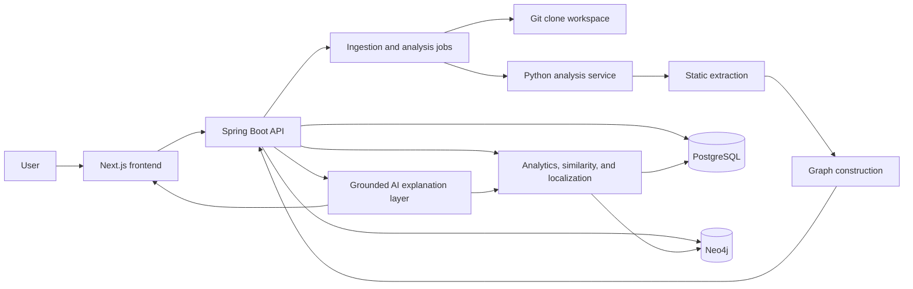

# GitHub Graph: End-to-End Project Plan

## 1. Document Purpose

This is the canonical implementation plan for GitHub Graph. It connects the
original ten project phases into one delivery roadmap and records:

- the product scope and supported repository types;
- the current implementation status;
- the target architecture and service boundaries;
- the work required in every phase;
- API, graph, and persistence contracts;
- testing and acceptance criteria;
- production, security, and scalability requirements;
- documentation and placement-readiness deliverables.

The plan is intentionally implementation-oriented. A phase is complete only
when its code, integration, tests, documentation, and acceptance checks are all
complete.

## 2. Product Vision

GitHub Graph is a repository-intelligence platform that converts source code
into a queryable dependency graph and uses graph algorithms, similarity
analysis, failure evidence, and grounded AI explanations to help developers
understand unfamiliar repositories and diagnose failures.

The finished product should answer:

1. What does this repository do?
2. What are its major modules and entry points?
3. Which files, classes, functions, APIs, and modules depend on each other?
4. What depends on a selected node?
5. What may break if a selected function, file, or module fails?
6. Which nodes are critical, highly connected, or part of a dependency cycle?
7. Which functions or modules are structurally similar?
8. What is the likely root cause of a supplied error or stack trace?
9. Why did the system reach that conclusion?
10. Can the answer be explored visually and exported for later use?

## 3. Scope

### 3.1 Initial product scope

- Analyze one GitHub repository per ingestion job.
- Accept public GitHub repositories only.
- Clone and analyze a specific repository snapshot.
- Retain repository and analysis history.
- Start with Python for deep static analysis.
- Detect Java, JavaScript, and TypeScript immediately.
- Add deep extraction for Java, JavaScript, and TypeScript after the Python
  pipeline is stable.
- Use deterministic graph and analytics results wherever possible.
- Use AI only to explain retrieved evidence, never as the source of graph facts.

### 3.2 Supported-language roadmap

| Language | Ingestion and detection | Deep extraction | Graph and analytics | Target order |
|---|---:|---:|---:|---:|
| Python | Implemented | Implemented | Implemented | 1 |
| Java | Implemented | Planned | Planned | 2 |
| JavaScript | Implemented | Planned | Planned | 3 |
| TypeScript | Implemented | Planned | Planned | 4 |

Deep extraction means extracting classes, functions or methods, imports,
calls, inheritance, API routes, and resolvable module dependencies.

### 3.3 Out of scope until the core product is stable

- Private repositories and GitHub App installation flows.
- Editing or committing to analyzed repositories.
- Runtime tracing inside the target repository.
- Organization-wide multi-repository graphs.
- Automatic code fixes.
- Full semantic equivalence or formal program verification.
- Guaranteeing a root cause without sufficient evidence.

## 4. Current Audited Baseline

The following status reflects the verified repository state before this plan
was created.

| Phase | Current status | Main gap |
|---|---|---|
| 1. Scope and architecture | Substantially complete | Canonical product scope was spread across multiple documents. |
| 2. Ingestion and indexing | Mostly complete | Explicit public-repository verification and reliable dependency readiness are missing. |
| 3. Static extraction | Complete for Python | Java, JavaScript, and TypeScript deep parsing remain future work. |
| 4. Code graph | Complete for Python analysis | Interactive graph exploration belongs to Phase 8. |
| 5. Graph analytics | Complete at backend/API level | Frontend analytics views remain for Phase 8. |
| 6. Similarity and bug localization | Engine complete, integration incomplete | No HTTP API, durable failure history, backend facade, or frontend consumer. |
| 7. AI explanation | Not started | Requires stable Phase 5 and 6 APIs first. |
| 8. Frontend and visualization | Partially started | Current UI shows extraction and graph previews, not a full explorer. |
| 9. Production features | Partially started | Async jobs and persistence exist; auth, retries, caching, history UI, and large-repo controls are missing. |
| 10. Placement polish | Partially started | Phase documents exist; benchmarks, case studies, video, and final architecture pack are missing. |

Verified baseline:

- Python test suite passes.
- Spring Boot test suite passes.
- Next.js production build passes.
- Docker images build.
- A real public Python repository can be ingested successfully.
- Extracted graph data is persisted in Neo4j and returned through the backend.
- Phase 5 analytics endpoints work against persisted graph data.
- Phase 6 engines work when called directly as Python services.

Known runtime issue:

- The API may start before Neo4j is ready. The Neo4j schema initializer can
  fail and stop the API container. Compose health checks, readiness conditions,
  and/or application-level retry logic must be added before the stack is
  considered reliable.

## 5. Target Architecture

### 5.1 Services

#### Next.js frontend

Responsibilities:

- repository submission;
- ingestion progress and history;
- repository dashboard;
- code graph visualization;
- node search and detail panels;
- analytics and similarity views;
- error and stack-trace submission;
- AI conversation interface;
- report export controls.

The frontend must not implement graph algorithms or make ungrounded AI
decisions.

#### Spring Boot API

Responsibilities:

- public API ownership;
- GitHub URL validation and public-repository verification;
- repository, snapshot, user, and job lifecycle management;
- clone orchestration;
- relational persistence;
- calling the Python analysis service;
- Neo4j graph persistence and retrieval;
- analytics and intelligence API facade;
- authentication and authorization;
- caching, retries, rate limits, and audit logging;
- report generation coordination.

#### Python analysis service

Responsibilities:

- language and framework detection;
- static code extraction;
- normalized graph-payload generation;
- graph analytics where shared Python implementations are required;
- similarity, clustering, failure-path parsing, and bug localization;
- evidence packages for AI explanation;
- parser plugins for each supported language.

The service should remain stateless for repository content. Durable state
belongs in PostgreSQL, Neo4j, object storage, or an explicitly selected cache.

#### PostgreSQL

Stores:

- users and authentication metadata;
- repositories;
- ingestion and analysis jobs;
- repository snapshots and commit metadata;
- file and symbol indexes;
- stored analysis-result metadata;
- historical failures;
- saved searches and reports;
- audit and retry metadata.

#### Neo4j

Stores:

- repository graph nodes and relationships;
- one graph namespace per repository snapshot;
- indexes and constraints needed for stable graph queries.

#### Optional production infrastructure

- Redis for cache, rate limiting, distributed locks, and job state acceleration;
- a job broker such as RabbitMQ or Redis Streams when in-process async work is
  no longer sufficient;
- S3-compatible object storage for generated reports and large raw artifacts;
- an LLM provider for Phase 7 explanations.

### 5.2 End-to-end data flow

1. User submits a public GitHub URL.
2. Backend normalizes the URL and verifies repository visibility.
3. Backend creates or resolves the logical repository record.
4. Backend creates an ingestion job.
5. Worker clones the repository into an isolated snapshot directory.
6. Backend records branch, commit, author, timestamp, and clone metadata.
7. Python service scans files and detects languages and frameworks.
8. Language parsers create normalized static-code JSON.
9. Python service builds a stable graph payload.
10. Backend stores operational metadata in PostgreSQL.
11. Backend stores graph nodes and edges in Neo4j.
12. Backend marks the job complete only after both stores succeed.
13. Analytics APIs query the graph for structural results.
14. Similarity and localization APIs combine graph and failure-history evidence.
15. AI APIs receive a bounded evidence package and produce a grounded
    explanation with references.
16. Frontend visualizes raw graph facts, algorithm results, and explanations.

## 6. Canonical Graph Model

### 6.1 Node types

| Type | Purpose | Key properties |
|---|---|---|
| `repo` | Logical repository root | repository ID, URL, owner, name |
| `file` | File in a snapshot | path, language, extension, size |
| `class` | Class or interface | qualified name, file, lines, language |
| `function` | Function, method, or constructor | qualified name, file, lines, parameters |
| `api` | HTTP or framework route | method, path, handler, framework |
| `module` | Imported or referenced module | module name, internal/external status |

Potential future node types:

- `package`;
- `database`;
- `configuration`;
- `test`;
- `failure`;
- `commit`.

New node types must be versioned and added only when they answer a product
question that cannot be represented with properties or existing nodes.

### 6.2 Edge types

| Type | Direction | Meaning |
|---|---|---|
| `BELONGS_TO` | child to parent | Structural containment |
| `IMPORTS` | file to module | Import declaration |
| `CALLS` | caller to callee | Function or method call |
| `USES` | dependent to dependency | Resolved dependency or API handler |
| `INHERITS` | child to parent | Class inheritance |

### 6.3 Graph invariants

- Node IDs are stable for the same repository snapshot and source identity.
- Edge IDs are stable for the same source, target, type, and identity
  properties.
- Duplicate nodes and edges are collapsed.
- Every edge endpoint exists.
- Repository and snapshot IDs isolate graphs.
- Containment edges are excluded from dependency analytics by default.
- External or unresolved references are explicit and never silently resolved
  to an incorrect internal node.
- Graph schema version is stored with every analysis result.

## 7. API Surface

The exact DTOs can evolve, but endpoint responsibilities should remain stable.

### 7.1 Ingestion and repository APIs

| Method | Endpoint | Purpose |
|---|---|---|
| `POST` | `/api/v1/repositories/ingestions` | Submit a repository |
| `GET` | `/api/v1/ingestion-jobs/{jobId}` | Poll job status |
| `POST` | `/api/v1/ingestion-jobs/{jobId}/retry` | Retry eligible failure |
| `GET` | `/api/v1/repositories` | List accessible saved repositories |
| `GET` | `/api/v1/repositories/{repositoryId}` | Repository and latest snapshot summary |
| `GET` | `/api/v1/repositories/{repositoryId}/snapshots` | Analysis history |
| `GET` | `/api/v1/repositories/{repositoryId}/files` | Indexed files |
| `GET` | `/api/v1/repositories/{repositoryId}/symbols` | Indexed symbols |
| `GET` | `/api/v1/repositories/{repositoryId}/analysis` | Structured extraction JSON |
| `GET` | `/api/v1/repositories/{repositoryId}/graph` | Graph payload or graph slice |

### 7.2 Graph analytics APIs

| Method | Endpoint | Purpose |
|---|---|---|
| `GET` | `/api/v1/analytics/path/{nodeId}` | DFS dependency trace |
| `GET` | `/api/v1/analytics/impact/{nodeId}` | BFS impact spread |
| `GET` | `/api/v1/analytics/components` | Connected components |
| `GET` | `/api/v1/analytics/topological-order` | Dependency order |
| `GET` | `/api/v1/analytics/critical` | Centrality ranking |
| `GET` | `/api/v1/analytics/cycles` | Circular dependency detection |

Common query parameters should include:

- `repositoryId`;
- optional `snapshotId`;
- `maxDepth`;
- `edgeTypes`;
- `includeExternal`;
- pagination or result limit.

### 7.3 Similarity and localization APIs

| Method | Endpoint | Purpose |
|---|---|---|
| `GET` | `/api/v1/intelligence/similarity/{nodeId}` | Rank similar nodes |
| `GET` | `/api/v1/intelligence/clusters` | Return similarity clusters |
| `POST` | `/api/v1/intelligence/failures/localize` | Rank likely root causes |
| `POST` | `/api/v1/repositories/{repositoryId}/failures` | Store a failure record |
| `PATCH` | `/api/v1/failures/{failureId}` | Add confirmed cause or resolution |
| `GET` | `/api/v1/repositories/{repositoryId}/failures` | List failure history |

The localization response must contain:

- resolved graph nodes;
- unresolved evidence;
- impacted nodes;
- similar historical failures;
- ranked candidates;
- normalized score and confidence;
- explicit reason contributions;
- configuration and graph snapshot identifiers.

### 7.4 AI explanation APIs

| Method | Endpoint | Purpose |
|---|---|---|
| `POST` | `/api/v1/explanations/query` | Ask a grounded repository question |
| `GET` | `/api/v1/explanations/{explanationId}` | Retrieve saved explanation |
| `POST` | `/api/v1/explanations/{explanationId}/feedback` | Record usefulness feedback |

Every explanation response must include:

- answer;
- referenced nodes and paths;
- algorithms or retrieval steps used;
- uncertainty or missing evidence;
- snapshot ID;
- model and prompt version metadata.

## 8. Phase-by-Phase Delivery Plan

## Phase 1: Product Scope and Repository Types

### Objective

Create a stable product contract before implementation expands.

### Work

1. Confirm public, one-repository-at-a-time ingestion.
2. Confirm Python-first deep extraction.
3. Record Java, JavaScript, and TypeScript parser order.
4. Define the five primary product questions.
5. Define supported frameworks per language.
6. Define graph vocabulary and directional semantics.
7. Define limits for repository size, file count, binary files, generated
   directories, and clone duration.
8. Record non-goals and privacy boundaries.
9. Define phase-level acceptance criteria.

### Framework support targets

Python:

- standard modules and packages;
- FastAPI;
- Flask;
- Django;
- common `src/` layouts.

Java:

- Maven and Gradle;
- Spring Boot controllers, services, repositories, and configuration;
- standard inheritance and method invocation.

JavaScript and TypeScript:

- ESM and CommonJS;
- Node.js;
- Express;
- Next.js;
- React component and hook relationships where useful.

### Deliverables

- canonical product specification;
- supported-language and framework matrix;
- graph schema specification;
- documented repository and analysis limits.

### Acceptance gate

- All teams can determine whether a repository is supported without reading
  implementation code.
- Every major product question maps to one or more planned data or algorithm
  sources.

## Phase 2: Repository Ingestion and Project Indexing

### Objective

Reliably convert a public GitHub URL into an immutable internal snapshot and
searchable file index.

### Work

1. Validate URL syntax, scheme, host, owner, and repository.
2. Verify repository existence and public visibility through the GitHub API or
   a credential-free metadata request.
3. Reject private, missing, redirected, and unsupported repository URLs with
   clear errors.
4. Create idempotent repository records.
5. Create one ingestion job per requested analysis.
6. Clone with a configurable depth and timeout.
7. Prevent shell injection by using argument-based process execution.
8. Store branch, commit SHA, commit message, author, and commit timestamp.
9. Retain an isolated local snapshot.
10. Walk the repository with ignored-directory and binary-file policies.
11. Detect language and framework signals.
12. Persist files, directories, symbols, imports, and raw analysis metadata.
13. Make job transitions transactional and observable.
14. Add retry categories for network, clone, parser, database, and graph-store
    failures.
15. Add startup health checks for PostgreSQL, Neo4j, analysis, API, and web.
16. Make API startup tolerate temporary Neo4j unavailability.

### Required job states

`PENDING -> VALIDATING -> CLONING -> ANALYZING -> STORING -> COMPLETED`

Any active state may transition to `FAILED`. Retry creates a new attempt or
records an incremented attempt number without corrupting the previous result.

### Deliverables

- working repository submission and polling flow;
- persisted repository and snapshot metadata;
- retained clone snapshot;
- indexed file tree and language summary;
- reliable Docker startup.

### Acceptance gate

- A supported public repository reaches `COMPLETED`.
- A private or missing repository fails during validation with an actionable
  response.
- Repeated ingestion does not corrupt prior snapshots.
- Restarting the stack does not lose persisted metadata.
- `docker compose up --build` consistently starts all services without manual
  restarts.

## Phase 3: Static Code Extraction

### Objective

Convert source files into normalized, language-independent structured data.

### Work

1. Define a parser interface shared by all languages.
2. Keep Python AST extraction as the reference implementation.
3. Extract files, classes, functions, methods, imports, calls, inheritance,
   API routes, and module dependencies.
4. Preserve qualified names, source ranges, language, and parser diagnostics.
5. Resolve internal modules conservatively.
6. Record external and unresolved references explicitly.
7. Handle invalid files without failing the whole repository.
8. Exclude generated, vendored, cache, and dependency directories.
9. Add Java parsing.
10. Add JavaScript parsing.
11. Add TypeScript parsing.
12. Version the normalized extraction schema.

### Parser implementation options

- Python: standard `ast`, with Tree-sitter considered for cross-language
  consistency.
- Java: Tree-sitter Java or JavaParser.
- JavaScript: Tree-sitter JavaScript.
- TypeScript: Tree-sitter TypeScript/TSX.

Whichever parser is selected must provide source locations and deterministic
output.

### Deliverables

- structured per-file JSON;
- flattened query-friendly arrays;
- parser diagnostics and unsupported-file summary;
- schema version and language-specific parser version.

### Acceptance gate

- Golden fixtures validate every extracted relationship type.
- Malformed source files produce diagnostics rather than repository failure.
- Re-running extraction on the same snapshot produces stable JSON.
- Every supported language has framework and import-resolution fixtures.

## Phase 4: Code Graph

### Objective

Convert normalized extraction data into a durable, queryable repository graph.

### Work

1. Generate stable node and edge IDs.
2. Build all canonical node types.
3. Build containment, import, call, use, and inheritance edges.
4. Resolve API handlers to functions where possible.
5. Deduplicate nodes and edges.
6. Validate endpoint existence and graph invariants.
7. Persist the graph in Neo4j by repository and snapshot.
8. Add graph constraints and indexes.
9. Support replacement of a partially stored snapshot graph.
10. Return full graph payloads for small repositories.
11. Add paginated or neighborhood graph queries for large repositories.
12. Add graph schema versioning.

### Deliverables

- persisted Neo4j graph;
- graph retrieval API;
- graph summary counts;
- graph invariant validation report.

### Acceptance gate

- Stored node and edge counts match the generated payload.
- No duplicate stable identities or dangling edges exist.
- Graph retrieval returns the latest or requested snapshot.
- Re-ingestion produces an isolated new snapshot graph.
- The frontend can display graph counts and a basic relationship preview.

## Phase 5: Graph Analytics

### Objective

Answer structural dependency and impact questions over the repository graph.

### Work

1. Define edge projections for each algorithm.
2. Implement DFS dependency tracing.
3. Implement incoming-edge BFS impact spread.
4. Implement weakly connected components.
5. Implement dependency topological sorting.
6. Implement directed cycle detection.
7. Implement normalized degree centrality.
8. Add depth, edge-type, node-type, external-node, and result-limit controls.
9. Keep results deterministic.
10. Expose all analytics through Spring Boot APIs.
11. Add request validation and consistent error responses.
12. Record runtime and result-size metrics.

### Deliverables

- dependency-path endpoint;
- impact-analysis endpoint;
- component endpoint;
- topological-order endpoint;
- cycle endpoint;
- critical-node endpoint.

### Acceptance gate

- Unit fixtures cover acyclic, cyclic, disconnected, recursive, external, and
  empty graphs.
- All endpoints return stable node IDs and human-readable node metadata.
- Results against a real ingested repository can be reproduced.
- Large-result requests are bounded by pagination, limits, or maximum depth.

## Phase 6: Similarity and Bug Localization

### Objective

Turn graph structure and failure evidence into explainable similarity and
root-cause rankings.

### Workstream A: Complete service integration

1. Keep weighted Jaccard feature extraction as the core deterministic engine.
2. Keep same-type similarity ranking and transitive clustering.
3. Add internal FastAPI request and response routes.
4. Add Spring Boot public facade endpoints.
5. Add DTO validation, limits, thresholds, and error handling.
6. Add frontend API client types.

### Workstream B: Durable failure history

1. Add PostgreSQL failure, evidence, resolution, and confirmed-cause tables.
2. Store repository and snapshot identity with each failure.
3. Store normalized exception type and message fingerprint.
4. Store raw stack trace only under an explicit retention policy.
5. Replace local JSON history with a database-backed implementation while
   retaining the interface for tests.
6. Allow users to confirm or reject suspected causes.

### Workstream C: Similarity features

1. Rank similar functions, files, and modules.
2. Return feature-family scores and matched evidence.
3. Generate deterministic similarity clusters.
4. Add thresholds and result limits.
5. Add safeguards for quadratic clustering on large graphs.
6. Cache similarity results per graph snapshot and configuration.

### Workstream D: Bug localization

1. Accept a failing node, stack trace, error log, or ordered failure path.
2. Resolve frames to the most specific graph functions.
3. Keep ambiguous and external frames unresolved.
4. Traverse an explicitly bounded impacted region.
5. Compare against repository-scoped historical failures.
6. Rank candidates using current path, stack, history, structural proximity,
   and bounded criticality.
7. Return score contributions and confidence.
8. Never return high confidence from unresolved-only evidence.

### Deliverables

- similarity ranking API;
- similarity clustering API;
- failure-history persistence;
- bug-localization API;
- integration tests from persisted graph to API response;
- frontend-ready DTOs.

### Acceptance gate

- Phase 6 features are callable through the public backend.
- Responses include evidence, not only scores.
- Repository and snapshot isolation is enforced.
- A real graph returns meaningful similarity candidates.
- A supplied test stack trace resolves expected functions.
- Confirmed historical causes influence rankings in a tested, bounded way.
- No-history and unresolved-only cases remain useful and honest.

## Phase 7: Grounded AI Explanation Layer

### Objective

Explain graph and analytics evidence in natural language without inventing
repository facts.

### Work

1. Define supported intents:
   - repository overview;
   - entry-point and flow explanation;
   - dependency explanation;
   - impact explanation;
   - cycle explanation;
   - similarity explanation;
   - failure and root-cause explanation.
2. Build deterministic intent routing before LLM invocation.
3. Retrieve only relevant graph nodes, source metadata, analytics results, and
   failure evidence.
4. Construct a bounded evidence package.
5. Create prompts that separate evidence, instructions, and user content.
6. Require node references for factual claims.
7. Include uncertainty when evidence is incomplete.
8. Protect against prompt injection from repository content.
9. Add token and cost budgets.
10. Add timeout, retry, and fallback behavior.
11. Store explanation, model, prompt version, evidence IDs, and user feedback.
12. Add evaluation datasets and groundedness checks.

### Grounding rules

- The model cannot create nodes or relationships.
- Every dependency claim must trace to graph evidence.
- Every impact claim must trace to an analytics result.
- Every similarity claim must include similarity evidence.
- Every root-cause claim must be labeled as a ranked hypothesis.
- Source snippets must be bounded and tied to file and line metadata.

### Deliverables

- conversational explanation API;
- evidence-retrieval layer;
- prompt templates and versions;
- explanation history;
- evaluation report.

### Acceptance gate

- Answers reference the correct repository snapshot and graph nodes.
- Unsupported questions receive a clear limitation response.
- Prompt injection fixtures do not override system grounding rules.
- Evaluation cases meet agreed factuality, groundedness, latency, and cost
  thresholds.

## Phase 8: Frontend and Visualization

### Objective

Turn repository intelligence into a polished, explorable product.

### Pages

1. Landing and repository submission.
2. Repository list and history.
3. Ingestion job progress.
4. Repository overview dashboard.
5. Interactive graph explorer.
6. Node detail and dependency view.
7. Analytics dashboard.
8. Similarity and cluster view.
9. Error analysis and root-cause view.
10. AI conversation view.
11. Reports and exports.

### Graph explorer requirements

- pan, zoom, fit, and reset;
- node labels and type-specific visual encoding;
- edge-type filters;
- node-type filters;
- search by file, qualified symbol, route, or module;
- neighborhood expansion;
- click-to-open detail panel;
- dependency and impact highlighting;
- path highlighting;
- cycle highlighting;
- cluster coloring;
- large-graph degradation strategy;
- accessible list/table alternative.

### Node detail requirements

- stable ID and type;
- label and qualified name;
- file and source lines;
- incoming and outgoing relationships;
- callers and callees;
- impact and dependency actions;
- centrality rank;
- similar nodes;
- linked API route or class context.

### Error analysis requirements

- stack trace and error-log input;
- optional failing-node selection;
- resolved and unresolved frame display;
- impacted-region visualization;
- ranked candidates with confidence;
- evidence contribution breakdown;
- similar historical failures;
- confirmed-root-cause workflow.

### Deliverables

- responsive repository dashboard;
- interactive graph explorer;
- analytics views;
- similarity and localization views;
- AI conversation interface;
- accessible loading, empty, and error states.

### Acceptance gate

- Main workflows work on desktop and mobile.
- Large graphs do not freeze the page.
- Keyboard navigation and contrast meet accessibility expectations.
- Every displayed score has an explanation or evidence path.
- End-to-end browser tests cover submission through analysis exploration.

## Phase 9: Production Features

### Objective

Make the platform reliable, secure, observable, and deployable.

### Authentication and authorization

1. Add user registration or an OAuth/OIDC provider.
2. Protect repository, history, report, and explanation APIs.
3. Add ownership or workspace membership.
4. Enforce authorization at service and query boundaries.
5. Plan GitHub App authorization before private repository support.

### Async processing

1. Move long-running work to a durable queue.
2. Add idempotency keys.
3. Add attempt count and retry policy.
4. Add dead-letter handling.
5. Add cancellation.
6. Add progress events or controlled polling.
7. Prevent duplicate concurrent analysis of the same snapshot.

### Caching

Cache by repository ID, snapshot ID, algorithm, and configuration:

- repository summaries;
- graph neighborhoods;
- analytics results;
- similarity rankings;
- AI evidence packages;
- completed explanations where appropriate.

Cache invalidation occurs when a new snapshot becomes active or an algorithm
version changes.

### Large-repository support

1. Define hard and soft file, byte, node, and edge limits.
2. Stream or batch file scanning.
3. Batch Neo4j writes.
4. Avoid returning full graphs by default.
5. Add graph neighborhood APIs.
6. Add parser worker pools with bounded concurrency.
7. Add time and memory budgets.
8. Surface partial-analysis status and diagnostics.

### Reliability

- health, readiness, and liveness checks;
- dependency startup retry;
- transactional or compensating graph persistence;
- graceful shutdown;
- timeouts for Git, HTTP, databases, parsers, and LLM calls;
- structured errors and stable error codes;
- retry only transient failures;
- backup and restore procedures.

### Security

- strict GitHub URL allowlist;
- SSRF prevention;
- clone and file-path sandboxing;
- path traversal prevention;
- repository size limits;
- secret management;
- dependency scanning;
- container non-root users where feasible;
- database least privilege;
- CORS allowlist;
- request body and stack-trace size limits;
- sensitive-data redaction;
- audit logging.

### Observability

Metrics:

- ingestion count, duration, and failure category;
- files parsed per language;
- parser error rate;
- graph node and edge counts;
- Neo4j write and query latency;
- analytics and similarity latency;
- cache hit rate;
- LLM latency, token use, cost, and failure rate;
- frontend API and rendering errors.

Logs must include correlation, repository, snapshot, job, and request IDs while
excluding secrets and unnecessary source content.

### Export

- raw structured analysis JSON;
- graph JSON;
- analytics report JSON;
- PDF summary;
- optional CSV node and edge exports.

### Deliverables

- authenticated multi-user application;
- durable job processing and retry;
- caching;
- analysis history;
- report exports;
- production deployment manifests;
- monitoring dashboards and alerts;
- backup and recovery runbook.

### Acceptance gate

- Security review has no unresolved critical findings.
- Failure injection demonstrates safe retries and no data corruption.
- Load tests meet target latency and throughput.
- Backup restoration is tested.
- Production deployment can be recreated from documentation and configuration.

## Phase 10: Placement and Portfolio Polish

### Objective

Present the engineering depth and product value clearly.

### Required artifacts

1. Current architecture diagram.
2. End-to-end ingestion sequence diagram.
3. Graph schema diagram.
4. Similarity and localization explanation.
5. One-page project summary.
6. Three-to-five-minute demo video.
7. Screenshots or a hosted demo.
8. Benchmark report.
9. At least two repository case studies.
10. Testing and quality summary.
11. Deployment and local setup guide.
12. Resume bullets.
13. Interview talking points and trade-offs.

### Benchmark dimensions

- repository file count and source size;
- clone duration;
- extraction duration;
- graph construction and persistence duration;
- node and edge counts;
- analytics latency;
- similarity latency;
- localization latency;
- frontend graph rendering threshold;
- memory consumption;
- cold and cached response times.

### Suggested case studies

1. A small Python library for easy graph validation.
2. A Python web application with API routes.
3. A repository containing a known circular dependency.
4. A repository with repeated or structurally similar functions.
5. A controlled failure fixture with a known root cause.

### Resume framing

> Built a GitHub repository intelligence platform using Spring Boot, Python,
> Next.js, PostgreSQL, Neo4j, and graph algorithms to extract code
> dependencies, perform impact and similarity analysis, localize likely
> failure causes, and produce grounded AI explanations.

### Acceptance gate

- The demo completes without manual database intervention.
- Benchmarks are reproducible.
- Claims in the write-up match measured results.
- Architecture and trade-offs can be explained in an interview.
- README setup works on a clean machine.

## 9. Cross-Phase Testing Strategy

### 9.1 Unit tests

- URL normalization and validation;
- language and framework detection;
- parser visitors and import resolution;
- graph ID stability and deduplication;
- graph algorithms;
- Jaccard scoring and weighting;
- clustering;
- failure-path resolution;
- root-cause evidence scoring;
- prompt-evidence construction.

### 9.2 Contract tests

- Spring Boot to Python request and response compatibility;
- analysis JSON to Java DTO compatibility;
- graph payload to Neo4j persistence compatibility;
- backend DTO to frontend TypeScript compatibility;
- schema-version compatibility.

### 9.3 Integration tests

- PostgreSQL migrations;
- Neo4j constraints and graph round trips;
- real temporary Git repository ingestion;
- analysis-service calls over HTTP;
- persisted graph analytics;
- failure-history-backed localization;
- authentication and authorization boundaries.

### 9.4 End-to-end tests

1. Submit repository.
2. Poll job.
3. Verify snapshot and files.
4. Open graph.
5. Search for a node.
6. Trace dependencies.
7. Run impact analysis.
8. Find similar nodes.
9. Submit an error.
10. Review root-cause candidates.
11. Ask for an AI explanation.
12. Export a report.

### 9.5 Performance tests

Create small, medium, and large repository fixtures. Track regressions for:

- scanning;
- parsing;
- graph creation;
- persistence;
- graph retrieval;
- each analytics endpoint;
- similarity ranking;
- clustering;
- localization;
- frontend graph rendering.

### 9.6 Quality gates

Before merging:

- formatting and linting pass;
- unit and contract tests pass;
- changed services build;
- no secrets are committed;
- migrations are backward-safe;
- API and schema changes are documented.

Before release:

- all service builds pass;
- full integration and end-to-end suites pass;
- dependency and container scans pass;
- benchmark smoke test passes;
- rollback procedure is documented.

## 10. Data and Migration Plan

### PostgreSQL additions

Expected production tables beyond the current baseline:

- `users`;
- `user_repository_access`;
- `analysis_job_attempts`;
- `failure_records`;
- `failure_evidence`;
- `failure_confirmed_causes`;
- `saved_explanations`;
- `explanation_feedback`;
- `generated_reports`;
- `audit_events`.

### Version fields

Store:

- extraction schema version;
- parser version by language;
- graph schema version;
- analytics version;
- similarity profile version;
- localization scoring version;
- prompt version;
- model identifier.

Versioning makes cached results, historical comparisons, and benchmark claims
reproducible.

### Retention

Define separate retention policies for:

- cloned repositories;
- raw source-derived JSON;
- graph snapshots;
- stack traces and error logs;
- generated reports;
- AI prompts and responses;
- application logs.

## 11. Delivery Milestones

### Milestone A: Reliable Python foundation

Includes:

- Phase 1 closure;
- Phase 2 startup reliability and public-repo validation;
- Phase 3 Python extraction;
- Phase 4 graph persistence.

Exit result:

- one command starts the stack and a public Python repository consistently
  becomes a persisted graph.

### Milestone B: Structural intelligence

Includes:

- Phase 5 APIs;
- graph query limits;
- analytics integration tests;
- initial analytics UI.

Exit result:

- users can query dependencies, impacts, cycles, components, ordering, and
  critical nodes.

### Milestone C: Similarity and diagnosis

Includes:

- Phase 6 public APIs;
- durable failure history;
- similarity and localization UI;
- real-graph integration tests.

Exit result:

- users can find similar nodes and receive evidence-backed root-cause rankings.

### Milestone D: Grounded explanations and polished exploration

Includes:

- Phase 7;
- full Phase 8 graph, analytics, failure, and chat experiences.

Exit result:

- users can explore the graph and ask grounded repository questions.

### Milestone E: Production release

Includes:

- Phase 9 authentication, queueing, cache, reliability, security,
  observability, exports, and deployment.

Exit result:

- the system is safely deployable and maintainable.

### Milestone F: Placement package

Includes:

- Phase 10 benchmarks, case studies, diagrams, demo, write-up, and resume
  material.

Exit result:

- the project is ready to demonstrate and discuss in interviews.

## 12. Recommended Immediate Execution Order

The next implementation work should proceed in this order:

1. Fix Docker readiness and API startup retry.
2. Add explicit public-repository existence and visibility validation.
3. Add Phase 6 FastAPI routes.
4. Add Phase 6 Spring Boot facade endpoints.
5. Persist failure history in PostgreSQL.
6. Add Phase 6 contract and end-to-end tests.
7. Add graph neighborhood and search APIs needed by the frontend.
8. Build the Phase 5 and 6 frontend views.
9. Start the grounded AI evidence-retrieval layer.
10. Add Java deep parsing only after the Python end-to-end intelligence flow is
    stable.

This order closes reliability and integration gaps before increasing language
or AI scope.

## 13. First Three Implementation Sprints

### Sprint 1: Reliability and Phase 6 API foundation

- Add Compose health checks.
- Make API wait for healthy PostgreSQL, Neo4j, and analysis services.
- Add application-level Neo4j initialization retry.
- Add public repository verification.
- Define Phase 6 request and response contracts.
- Add FastAPI similarity and localization routes.
- Add route-level tests.

Sprint exit:

- clean stack startup is reliable;
- similarity and localization are callable inside the service over HTTP.

### Sprint 2: Phase 6 backend and persistence integration

- Add Spring Boot intelligence client and controllers.
- Add failure-history migrations and repositories.
- Add stored failure and confirmed-cause APIs.
- Replace runtime JSON history with database-backed history.
- Add cross-service contract tests.
- Add limits, timeouts, and structured errors.

Sprint exit:

- public backend exposes similarity and localization using persisted graph and
  history.

### Sprint 3: Intelligence frontend

- Add graph-node search and selection.
- Add similarity ranking and cluster views.
- Add error and stack-trace input.
- Add localization candidate panel and evidence breakdown.
- Highlight impacted nodes in the graph.
- Add loading, empty, unresolved, and failure states.
- Add browser end-to-end tests.

Sprint exit:

- a user can ingest a repository, select a function, inspect similar functions,
  submit an error, and review likely causes from the frontend.

## 14. Risks and Mitigations

| Risk | Impact | Mitigation |
|---|---|---|
| Static analysis cannot resolve dynamic calls | Incomplete graph | Preserve unresolved evidence, add confidence, avoid false internal links |
| Large graph payloads overwhelm API or UI | High latency or browser freeze | Neighborhood APIs, pagination, filters, server-side limits |
| Similarity clustering becomes quadratic | Slow large-repo analysis | Candidate blocking, type partitioning, cached features, size thresholds |
| Root-cause ranking appears more certain than evidence supports | Loss of trust | Explain contributions, cap confidence, show unresolved evidence |
| LLM invents repository facts | Incorrect explanations | Evidence-only prompts, references, deterministic retrieval, evaluations |
| Database and graph persistence diverge | Inconsistent snapshots | Transaction state, idempotent writes, reconciliation job |
| Dependency startup race | Backend unavailable | Health checks and retry with bounded backoff |
| Git clone abuse or oversized repositories | Resource exhaustion | Public verification, limits, timeout, sandbox, quotas |
| Multi-language schemas drift | Fragile graph consumers | Common parser contract, schema versioning, golden fixtures |
| Historical failure data contains secrets | Security exposure | Redaction, access control, retention, encryption |

## 15. Definition of Done

The project is complete only when:

- all four target languages have the agreed level of extraction support;
- public repository ingestion is reliable and validated;
- repository snapshots are reproducible;
- graph creation, persistence, retrieval, and visualization work;
- Phase 5 analytics are available through API and UI;
- Phase 6 similarity and localization are available through API and UI;
- failure history is durable and repository-scoped;
- AI explanations are grounded and referenced;
- authentication and authorization protect saved data;
- background processing, retries, caching, and limits are implemented;
- reports can be exported;
- automated unit, contract, integration, and end-to-end tests pass;
- security, load, backup, and recovery checks pass;
- setup and deployment documentation work on a clean environment;
- architecture, benchmarks, case studies, demo, and resume materials are
  complete.

## 16. Branch and Delivery Practice

- Create a dedicated branch for each phase, sub-phase, fix, or documentation
  change.
- Do not mix unrelated changes.
- Keep commits small and named after user-visible outcomes.
- Require tests and documentation in the same pull request as behavior changes.
- Avoid rewriting shared branch history.
- Tag milestone releases so benchmark and demo results remain reproducible.

Suggested branch patterns:

- `fix/docker-readiness`;
- `phase-6/intelligence-api`;
- `phase-6/failure-history`;
- `phase-8/graph-explorer`;
- `phase-9/authentication`;
- `docs/placement-package`.

## 17. Completion Tracking Checklist

### Foundation

- [x] Service scaffolding
- [x] Public GitHub URL format validation
- [x] Async ingestion workflow
- [x] Repository cloning
- [x] Commit and snapshot metadata
- [x] File and language indexing
- [ ] Explicit public visibility verification
- [ ] Reliable dependency readiness and startup retry

### Static analysis and graph

- [x] Python extraction
- [x] Stable graph construction
- [x] Neo4j graph persistence
- [x] Graph retrieval API
- [x] Basic frontend graph summary
- [ ] Java extraction
- [ ] JavaScript extraction
- [ ] TypeScript extraction
- [ ] Large-graph neighborhood API

### Analytics and intelligence

- [x] DFS
- [x] BFS
- [x] Connected components
- [x] Topological sort
- [x] Cycle detection
- [x] Degree centrality
- [x] Weighted Jaccard engine
- [x] Similarity clustering engine
- [x] Failure-path parser
- [x] Root-cause ranking engine
- [ ] Phase 6 HTTP APIs
- [ ] Durable failure history
- [ ] Phase 6 backend facade
- [ ] Analytics and intelligence frontend

### AI and visualization

- [ ] Evidence retrieval
- [ ] Grounded explanation API
- [ ] Prompt-injection defenses
- [ ] AI evaluation suite
- [ ] Interactive graph explorer
- [ ] Node detail panel
- [ ] Similarity view
- [ ] Error-analysis view
- [ ] Conversation view

### Production and placement

- [ ] Authentication and authorization
- [ ] Durable job queue and retries
- [ ] Caching
- [ ] Large-repository controls
- [ ] Observability
- [ ] Security review
- [ ] JSON and PDF export
- [ ] Production deployment
- [ ] Architecture diagram pack
- [ ] Benchmarks
- [ ] Case studies
- [ ] Demo video
- [ ] One-page write-up
- [ ] Final resume bullets
