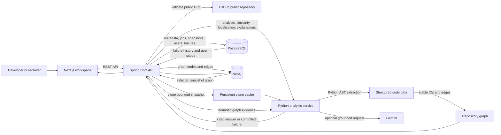

# GitHub Graph Architecture

## Request flow

1. The user submits one public GitHub repository through the Next.js workspace.
2. Spring Boot validates visibility, persists an asynchronous job, and clones a
   bounded local snapshot.
3. The Python service parses supported Python files with the standard AST,
   extracts symbols and relationships, then creates stable graph nodes and
   edges.
4. Spring Boot stores relational metadata in PostgreSQL and the connected
   dependency graph in Neo4j.
5. Analytics, similarity, failure localization, and explanations load the
   selected snapshot graph and return structured, evidence-backed results.

## Storage responsibilities

| Store | Responsibility |
| --- | --- |
| PostgreSQL | Users, saved repositories, jobs, snapshots, files, symbols, extraction JSON, and durable failure history. |
| Neo4j | Repository graph nodes and edges optimized for traversal and impact queries. |
| Clone cache | Bounded local repository snapshots reused by the analysis worker. |

The diagram is intentionally technology-specific: it is suitable for a project
report, README preview, or a placement presentation.
